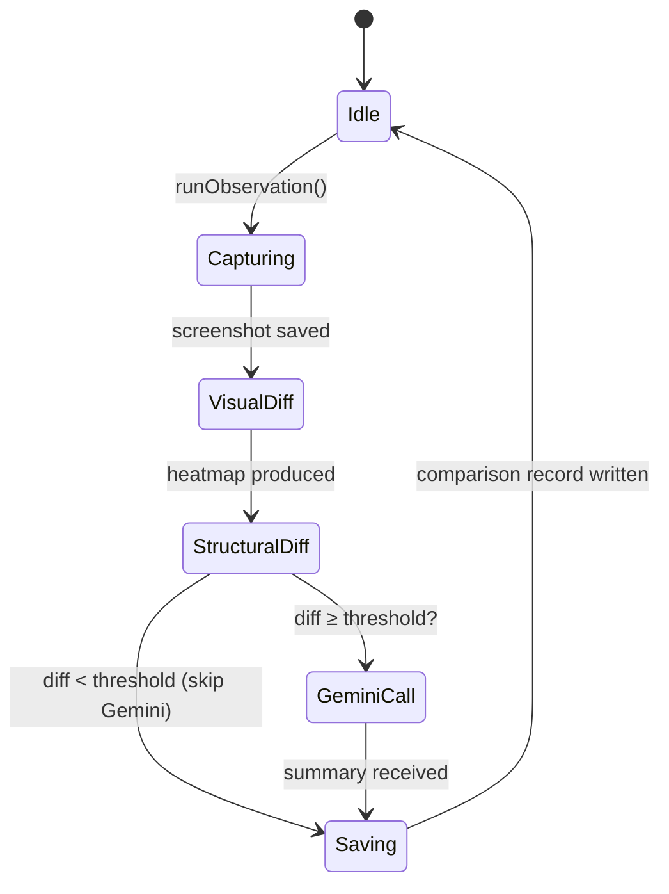

# Project Walkthrough: Web Observation Report System

## Phase 1: Core Engine & Persistence (Foundation) - COMPLETE

**Goal**: Establish the ability to register targets and capture baselines.

### Accomplishments

1. **Database Schema & Initialization**:
   - Implemented SQLite database using `better-sqlite3`.
   - Created `targets` table to store OTA company names and URLs.
   - Created `snapshots` table to track screenshots, DOM snapshots, and baseline status.
   - Files: `src/lib/db/index.ts`.

2. **Target Management Service**:
   - Developed `TargetService` for CRUD operations on OTA targets.
   - Allows registering, updating, and deleting monitoring targets.
   - Files: `src/lib/db/target-service.ts`.

3. **Capture Engine**:
   - Implemented `CaptureService` using **Playwright**.
   - Configured with realistic User-Agents and 1920x1080 viewport.
   - Capable of saving full-page PNG screenshots and sanitized DOM snapshots to `public/storage/baselines`.
   - Files: `src/lib/engine/capture-service.ts`.

4. **Snapshot & Baseline Management**:
   - Developed `SnapshotService` to manage recorded states.
   - Implemented logic to automatically designate the first capture as the "Baseline".
   - Supports retrieving historical snapshots and setting new baselines.
   - Files: `src/lib/db/snapshot-service.ts`.

### Verification

Ran `scripts/verify-phase1.ts` which successfully:
- Registered a test target (Google).
- Captured a high-fidelity screenshot and DOM snapshot.
- Persisted the records in SQLite and marked the initial state as the baseline.

---

## Phase 2: Change Detection & AI Summaries — COMPLETE

**Goal**: Detect differences between the baseline and a new capture, then explain them with Gemini.

### Architecture

```
CaptureService  →  VisualComparator  →  heatmap PNG
                →  StructuralComparator → text diff
                →  GeminiService    →  AI summary
                →  ComparisonService → SQLite record
```



### Accomplishments

1. **DB Schema Extension (`src/lib/db/index.ts`)**
   - Added `comparisons` table linking `baseline_snapshot_id` and `current_snapshot_id`.
   - Stores `heatmap_path`, `pixel_change_pct`, `structural_diff` (text), `ai_summary`.

2. **Comparison Service (`src/lib/db/comparison-service.ts`)**
   - `create()` — persists a full comparison result.
   - `getByTarget()` / `getLatest()` — retrieval helpers.

3. **Visual Comparator (`src/lib/analysis/visual-comparator.ts`)**
   - Reads two PNGs with `pngjs`, crops to minimum shared dimensions.
   - Runs `pixelmatch` (threshold 0.1, AA ignored).
   - Writes a red-heatmap PNG to `public/storage/diffs/`.
   - Returns `pixelChangePct` and `heatmapPath`.

4. **Structural Comparator (`src/lib/analysis/structural-comparator.ts`)**
   - Strips `<script>`, `<style>`, and all HTML tags via regex.
   - Runs `diffLines()` on the extracted visible text.
   - Returns `addedLines`, `removedLines`, `changePercent`, and up to 20 `significantChanges`.

5. **Gemini Service (`src/lib/analysis/gemini-service.ts`)**
   - Skips the API if both visual and structural changes are < 1% (cost guard).
   - Default model: `gemini-2.5-flash` (configurable via `GEMINI_MODEL` env var).
   - Sends a text prompt with change metrics and up to 10 sample diff lines.
   - Optionally attaches baseline and current screenshots as `inlineData` for vision analysis.
   - Falls back to text-only if the vision call fails.

### Verification (`scripts/verify-phase2.ts`)

Run:
```sh
npm run verify:phase2
```

**Test input**: Google homepage (`https://www.google.com`), captured twice in rapid succession.

**Output (2026-04-01)**:

| Metric | Value |
|---|---|
| Visual change | 0.05% pixels |
| Structural change | 10.53% (+4 lines) |
| Heatmap | `public/storage/diffs/2-20260401-223336-diff.png` |
| Gemini model | `models/gemini-2.5-flash` |
| Tokens used | 1,496 |

**Gemini AI Summary output**:
> This is a **significant UI update** on Google.com, indicating a new phase of AI integration into the search experience.
> A prominent "AI モード" (AI Mode) button has been added to the search bar. This mode appears to support image and file uploads, allowing users to leverage AI for search or analysis of their uploaded content. A new error message also specifies supported file formats for this feature.
> We recommend closely monitoring this rollout as it represents a fundamental shift in Google's core product functionality and user interaction patterns, potentially impacting search behavior and competitive strategies.

### New Files

| File | Purpose |
|---|---|
| `src/lib/db/comparison-service.ts` | CRUD for the `comparisons` table |
| `src/lib/analysis/visual-comparator.ts` | Pixel-level diff + heatmap |
| `src/lib/analysis/structural-comparator.ts` | Text-level DOM diff |
| `src/lib/analysis/gemini-service.ts` | AI summary via Gemini API |
| `scripts/verify-phase2.ts` | End-to-end integration test |

---

## Next Steps

### Phase 2.5: Testing - IN PROGRESS
- [x] Run integration test for **Expedia** baseline and change detection.
- **Verification (`scripts/verify-phase2-expedia.ts`)**:
  - Test input: Expedia homepage (`https://www.expedia.com`).
  - Output metrics recorded to SQLite correctly: visual change (1.88%), structural change.
  - Successfully generated the Markdown report `docs/expedia-report.md`.
- Write unit tests for `VisualComparator`, `StructuralComparator`, and `GeminiService`.
- Add a mock Gemini client so tests run without a real API key.

### Phase 3: Reporting & Exports
- Aggregate comparison records into Markdown and PPTX reports.
- Implement side-by-side visual diff view.
